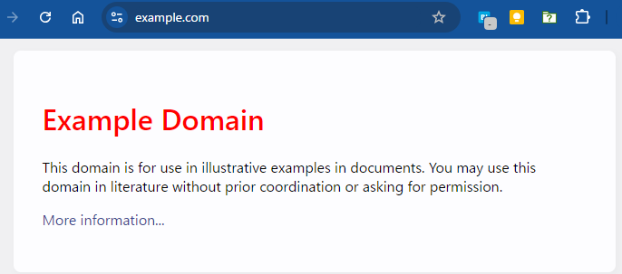

# chrome-remote-interfaceでChromeを操作する

JavaScriptでChromeを外部から操作して、任意のJavaScriptを実行することができるか調べたところ[Chrome DevTools Protocol](https://chromedevtools.github.io/devtools-protocol/)経由でChromeを操作する
[chrome-remote-interface](https://github.com/cyrus-and/chrome-remote-interface)を使うと簡単にできることが分かりました

https://github.com/cyrus-and/chrome-remote-interface

([PlayWright](https://playwright.dev/)のようなE2Eテストツールでもできるのですが、純粋にChromeを操作するツールを探してみました)

## chrome-remote-interfaceを使うための準備

npmで`chrome-remote-interface`をインストールします
```
$ npm i chrome-remote-interface
```

ES Modulesを利用可能にするため`package.json`に下記の設定を追加します

```
  "type": "module",
```

リモートデバッグを有効にしてChromeを起動しておきます
（Chromeが起動している場合は、先に終了してから下記コマンドを実行します）

```
chrome --remote-debugging-port=9222
```
※Chromeのインストールパスは適宜補ってください

## 指定したURLを開いて、画面のDOMを変更するサンプルスクリプト

スクリプトを起動する前に、Chromeをデバッグモードで起動しておきます

スクリプトを実行すると`example.com`が表示され、&lt;h1&gt;タグが赤色になります
```
$ node cdp-open-url.js
```




```JavaScript:cdp-open-url.js
import CDP from 'chrome-remote-interface';

async function openURL() {
  let client;
  try {
    // Chromeに接続
    client = await CDP();

    // 必要な機能を有効化
    const { Page, Runtime } = client;
    await Page.enable();
    await Runtime.enable();

    // 指定したURLを開く
    const url = 'https://example.com';
    await Page.navigate({ url });
    await Page.loadEventFired(); // 読み込み完了を待つ

    // <h1>を赤くする
    const expression = `document.querySelector('h1').style.color = 'red'`;
    await Runtime.evaluate({ expression });
  } catch (err) {
    console.error(err);
  } finally {
    if (client) {
      await client.close();
    }
  }
}

openURL();
```


## Gemini nanoを実行して結果を受け取ってみる

[Chrome128(stable)で利用可能になったGemini Nanoを試してみる](https://qiita.com/murasuke/items/5ad4f7d338fe2054211e)という記事でChromeに導入した`Gemini nano`をブラウザ外部から利用してみます

https://qiita.com/murasuke/items/5ad4f7d338fe2054211e

Geminiの呼び出しは非同期関数なので、呼び出し時に完了を待つために`awaitPromise: true`をつける必要がありました

```javascript
    const result = await Runtime.evaluate({
      expression, // Gemini呼び出しjs
      awaitPromise: true, // 非同期処理を待つ
    });

```

実行結果（Chrome外部からGemini nanoを呼び出して、結果を受け取ることができました）
```bash
$ node cdp-gemini.js
result:  日本で一番高い山は標高3,776メートルの富士山です。
```

```JavaScript:cdp-gemini.js
import CDP from 'chrome-remote-interface';
async function callGemini() {
  let client;
  try {
    // Chromeに接続
    client = await CDP();

    // 必要な機能を有効化
    const { Page, Runtime } = client;
    await Page.enable();
    await Runtime.enable();

    // gemini nanoを呼び出して結果を待つ
    const expression = `
      (async function() {
        const session = await window.ai.createTextSession();
        const message = await session.prompt("日本で一番高い山はなんですか？");
        return message;
      })();
    `;

    const result = await Runtime.evaluate({
      expression,
      awaitPromise: true, // 非同期処理を待つ
    });

    // 実行結果を表示
    console.log('result:', result.result.value);
  } catch (err) {
    console.error(err);
  } finally {
    if (client) {
      await client.close();
    }
  }
}

callGemini();

```
